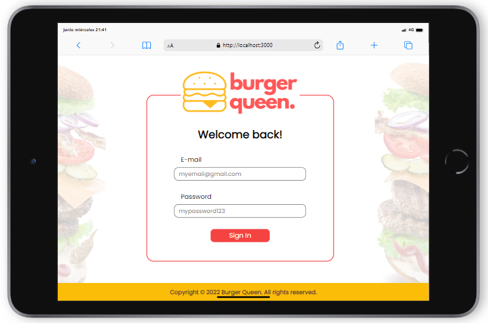
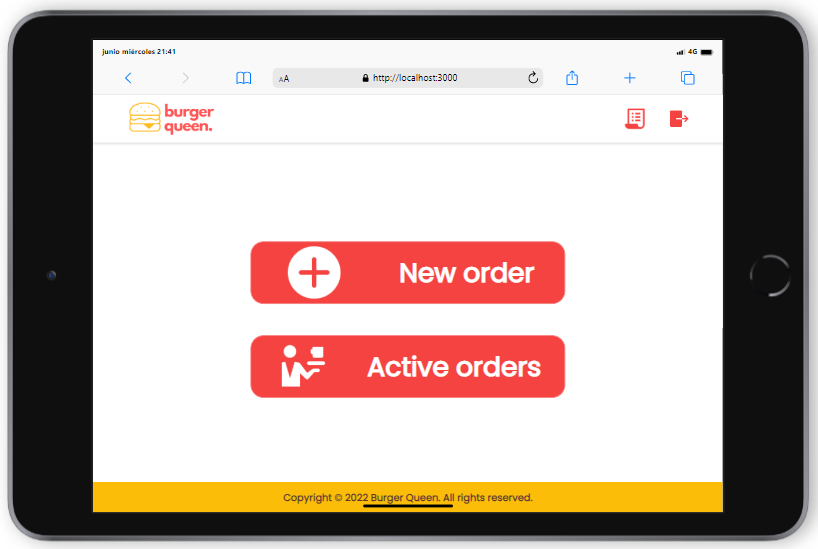
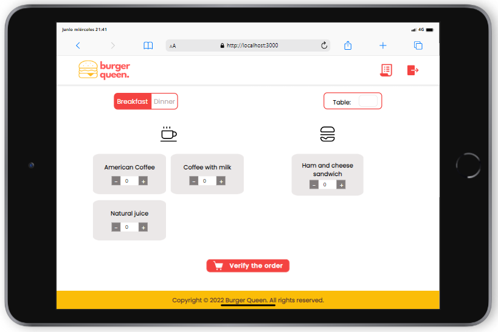
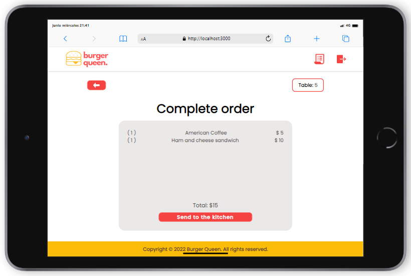
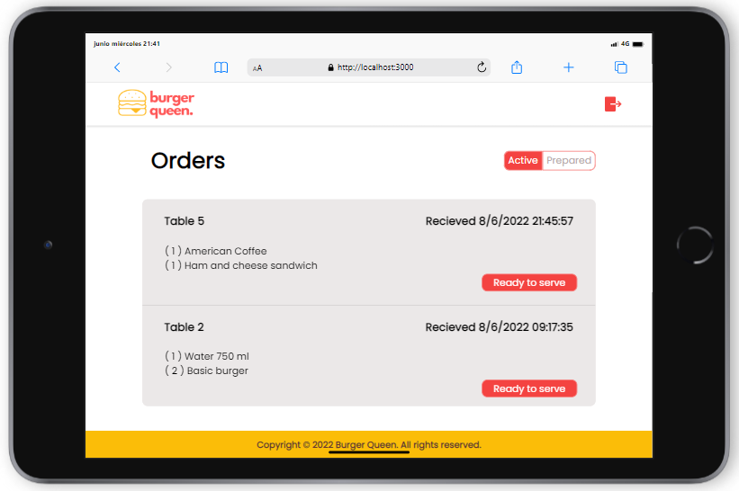
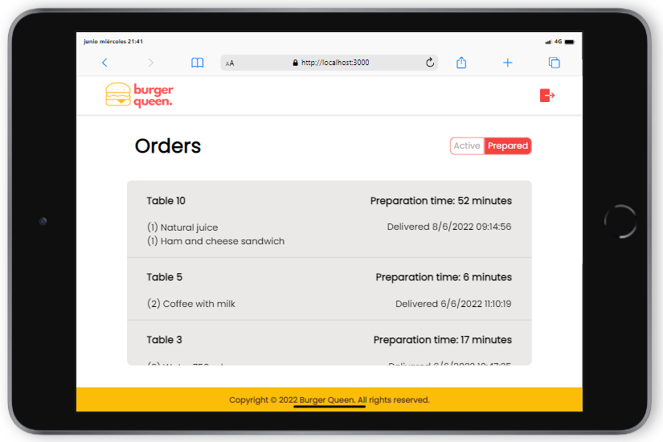
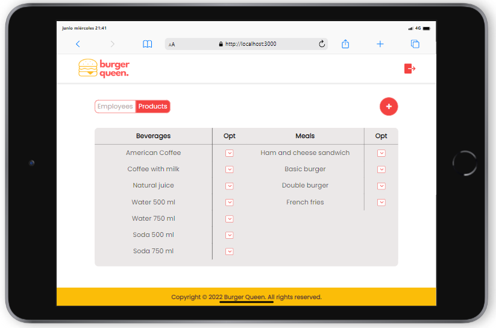

  <h1> Burger Queen Api Client </h1>

## Contents

* [1. Project description](#1-project-description)
* [2. Tech stack](#2-tech-stack)
* [3. User stories](#3-user-stories)
* [4. High fidelity prototypes](#4-high-fidelity-prototypes)
* [5. Usability tests](#5-usability-tests)
* [6. Deployed project](#6-deployed-project)
* [7. Authors](#7-authors)

## 1. Project description

This project is a *single page application* made with *React* for a small hamburger restaurant by the name of Burger Queen. Our application allows the management of different aspects of the restaurant based on the several roles an user can have, helping them to perform their assigned tasks. 

The roles we worked with are:
 
* **Manager:** Person in charge of keeping track of the employees, delete them or add new hires. They can also add, delete or edit any of the products in the menu.
* **Waiter:** They can take new orders, edit them and send them to the kitchen to be prepared. The waiter can access the "active orders" screen, where they will see the set of orders that have been served but not charged, or those that are ready to be served, once the kitchen marks them as such, and mark them as delivered after they have brought them to their respective clients. 
* **Chef:** The people working in the kitchen can see a list of orders that have been received and need to be cooked, can mark them as "ready" once they have been prepared, and can consult how long did it take to prepare them for optimization purposes. 

Our application is designed to be used on tablet devices, that's why we approached its design with a mobile-first perspective. 

## 2. Tech stack

## 3. User stories

In order to complete this project, the following user stories were solved:

## 4. High fidelity prototypes

Having the user stories in mind, we created high fidelity prototypes in which we wanted to portray an easy to understand interface and provide our users an optimal work flow. This prototypes were key to develop the project.

## 5. Usability tests
During the development, three usability tests were made and, based on these, the project was adapted to be more user-friendly.

### 5.1 User Story 1

Testing: 
- The user is able to log in with email and password.
- The user can understand the error messages, and correct their mistakes.

Feedback:
- Users wanted to see more descriptive error messages (e. g., what was causing the error, what could you do to fix it).
- Change of color from the error messages, from black to red.

### 5.2 User Story 2 and 4

Testing:
- The user can annotate the table’s number.
- The user can add and delete products to an order.
- The user can see a summary and total purchase.
- The user can edit the order.
- The user can send order to kitchen.
- The user can see the orders ready to be served and the ones delivered.

Feedback:
- Users wanted to be redirected to the main screen by clicking on the logo.
- In the order summary, users wanted to see a description of said order (quantity, product and price).
- Bigger letter size in 'Verify order' screen.

### 5.3 User Story 3, 5 and 6

Testing:
- The user can mark an order ready to serve.
- The user can check how long did it take to prepare it.
- The user can see a list of all their employees.
- The user can add an employee, edit it and delete it.
- The user can see a list of all their products.
- The user can add a product, edit and delete it.

Feedback:
- Placeholders on forms can be confusing to the user.
- Users expect to be able to edit their profile when clicking on the profile logo, not just to log out.

## 6. Deployed project

### 6.1 Log in screen

### 6.2 Waiter screens

### 6.3 Chef screens

### 6.4 Administrator screens

## 7. Authors

| Developers | Contact |
| ------------- | ------------- |
| Perla Del Ángel |   |
| Ziomara Jiménez |   |
| Ma. Isabela Huitrón |   |